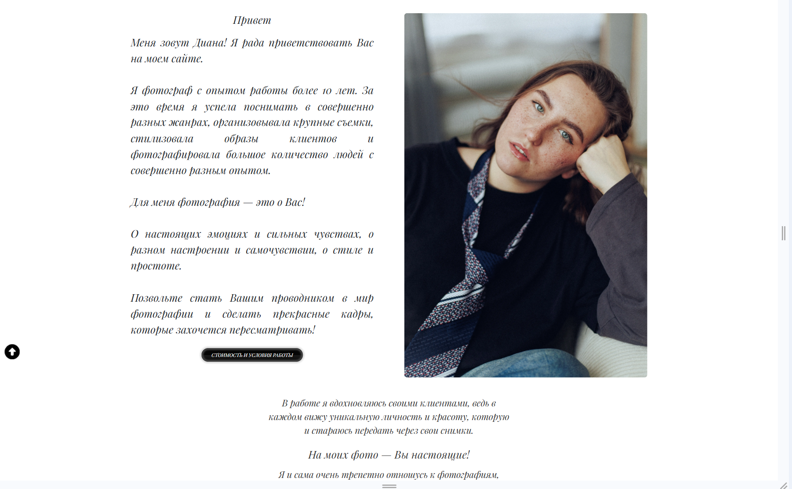
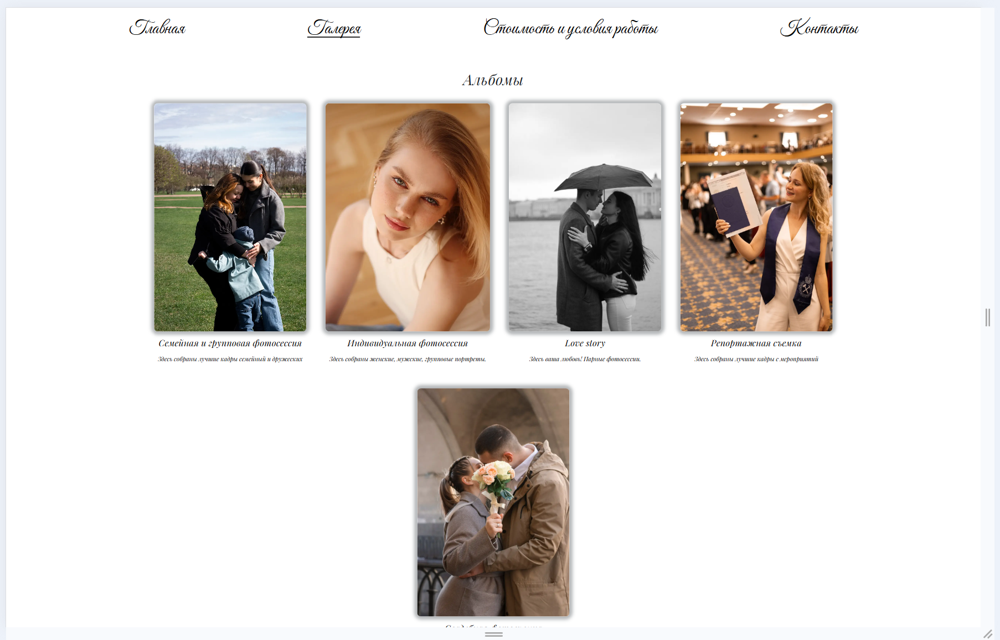
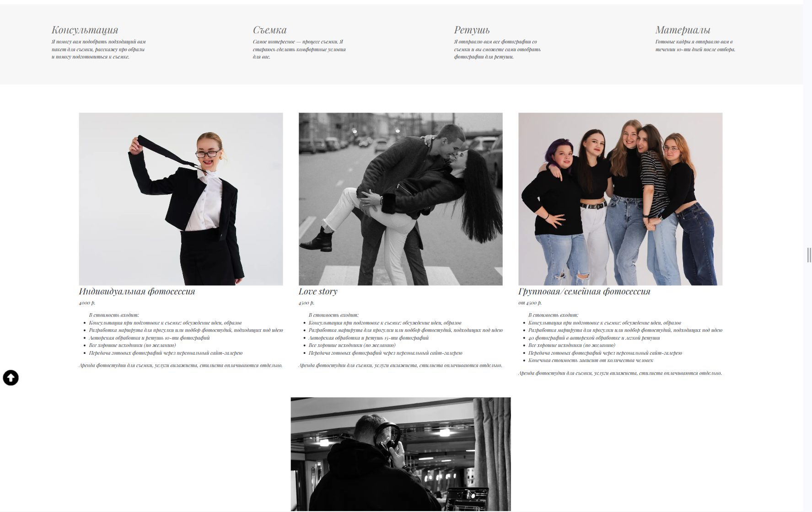
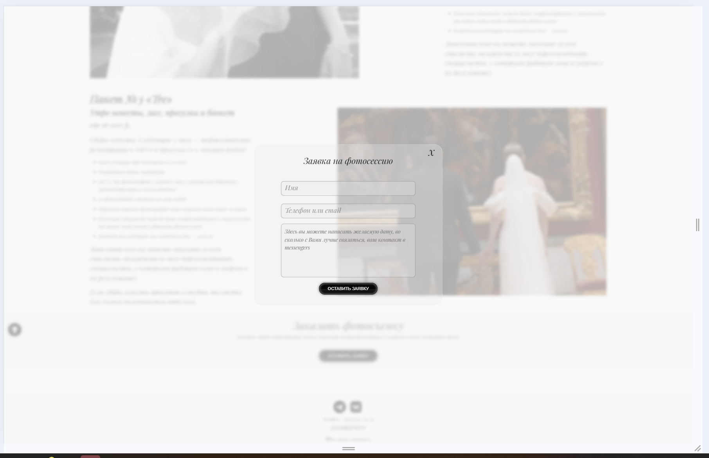
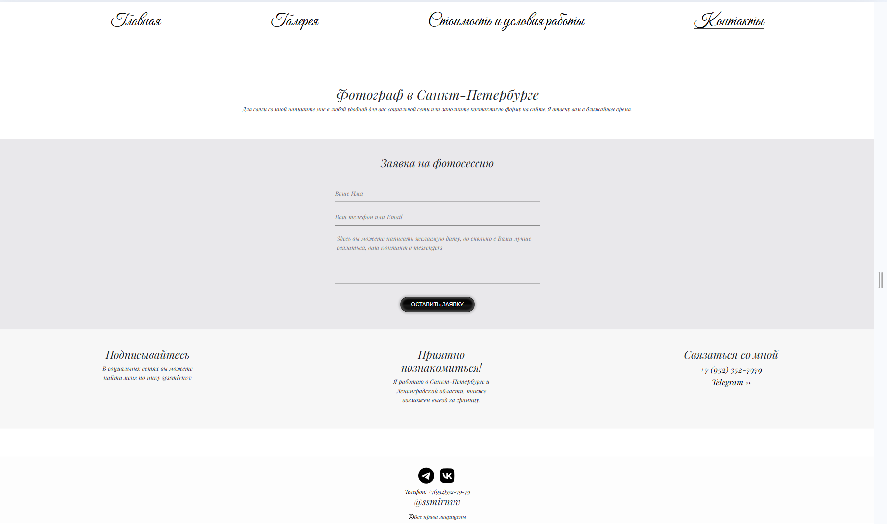

# Сайт для фотографа

## 📝 Описание проекта
Проект разработан на современном стеке **Next.js 16** с **React 19** и **TypeScript**. Стилизация выполнена с использованием **SCSS (Sass)** с модульным подходом — каждый компонент имеет свой SCSS модуль, что обеспечивает изоляцию стилей и удобство поддержки. Использованы переменные SCSS для цветовой схемы и миксины для адаптивности. Для UI компонентов применяется **Bootstrap 5** с кастомными SCSS-переопределениями. Галереи реализованы с помощью нескольких библиотек слайдеров (**Swiper**, **Keen-Slider**, **Embla Carousel**, **React Multi Carousel**) для оптимальной производительности на разных устройствах. Управление состоянием осуществляется через **Zustand**, отправка писем — через **Nodemailer**.

## 🛠 Технологический стек

### Frontend
- **Next.js 16** — React фреймворк с серверным рендерингом и App Router
- **React 19** — библиотека для построения пользовательских интерфейсов
- **TypeScript** — строгая типизация для надежности кода

### Стилизация
- **SCSS/Sass** — препроцессор CSS с переменными и миксинами
- **CSS Modules** — изоляция стилей на уровне компонентов
- **Bootstrap 5** — UI библиотека с кастомными SCSS-переопределениями

### Управление состоянием
- **Zustand** — легковесный менеджер состояний

### UI компоненты
- **React-Bootstrap** — Bootstrap компоненты для React
- **Swiper** — современный сенсорный слайдер
- **Keen-Slider** — легковесный слайдер без зависимостей
- **Embla Carousel** — производительная карусель
- **React Multi Carousel** — адаптивная карусель
- **React Photo View** — просмотрщик изображений

### Backend
- **Next.js API Routes** — серверные эндпоинты
- **Nodemailer** — отправка email через форму обратной связи

### Инструменты разработки
- **ESLint** — линтинг кода
- **Git** — система контроля версий

## ✨ Ключевые особенности

- 📸 **Фотогалерея** с множеством вариантов отображения
- 📱 **Адаптивный дизайн** с использованием SCSS
- 🎠 **Несколько типов слайдеров** для разных целей
- 📧 **Форма обратной связи** с отправкой email
- 🔄 **Динамические маршруты** для галерей и фотосессий
- 🏗 **Современная архитектура** Next.js App Router
- 🎨 **Модульные SCSS стили** для каждого компонента
- ⚡️ **Оптимизация производительности** с Zustand и Babel плагином

## 🖼️ Фото страниц:

